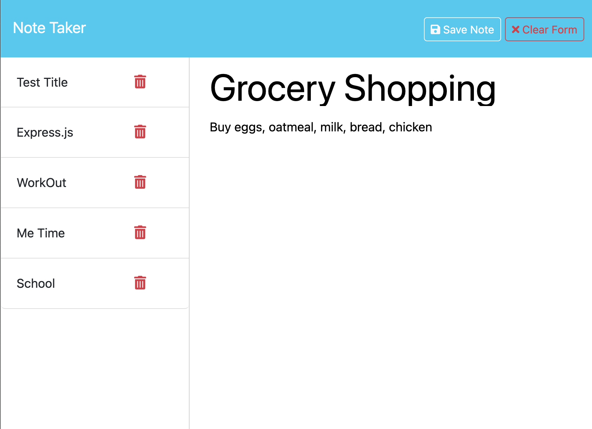

# Express Note Taker

## Description

This application allows the user to write notes with express.js. Users are able to store their notes on the app. This NoteTaker was made for people who need a little organization with their busy schedules. This app also comes with the additional feature to delete and create a new note. These notes are created with the user choice of Title for their note for ease of readability.

## Table of Contents

- [Installation](#installation)
- [Usage](#usage)
- [License](#license)
- [Contributing](#contributing)
- [Tests](#tests)
- [Questions](#questions)

## Installation

To Install necessary dependencies, make sure to run the following command:
`npm i`

## Usage

First, you will be taken to a welcome page where you can click on the Get Started button. Once you click the button, you will be directed to the Note Taker interface. You will see sample notes to the left of the screen. To start a note you need to 1)Give a Note Title and 2)Fill out the note with your text. Once you do both two buttons will appear at the top right corner. One is to save the note and the other to clear the form. To save, click on Save Note and it will be added to the list on the left. You see the text to the note by clicking on the note Title. To delete, simply click the trash can icon on the note. Your notes will not be deleted if you leave the website.
For full access click on this link > https://judy-her.github.io/express-notetaker/

## License

This project is licensed under the [mit](https://opensource.org/licenses/MIT) license.

## Contributing

If you would like to contribute, you can find this repo at [judy-her](https://github.com/judy-her)

## Tests

To run tests, run the following command:
`npm test`

## Questions

For questions about the repo, feel free to email me Judith Hernandez at judith85dm@ucla.edu
